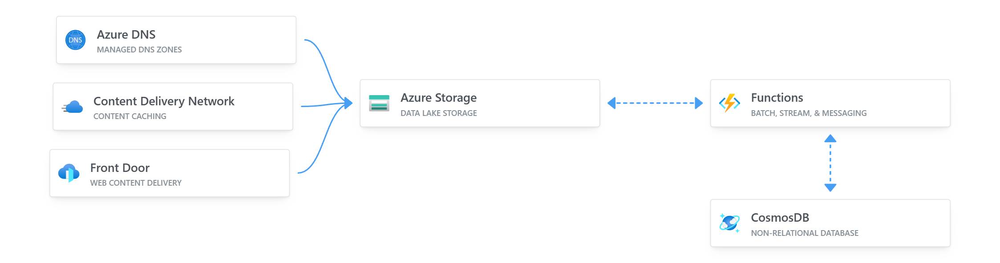

# GPS's Azure Resume

This is my Cloud Resume Challenge built on Azure. It's a static website hosted on Azure Storage, with a visitor counter built on Azure Functions. The website is built with HTML, CSS, and JavaScript. The visitor counter is built with .NET and Azure Functions. 

If you'd like to build your own, here is the YouTube video [video](https://youtu.be/ieYrBWmkfno) 

## Demo

[View it live here](https://www.gpsresume.com/)

## Pre-requisites

I leverage [Dev Containers](https://code.visualstudio.com/docs/remote/containers) for my development environment. If you'd like to use it, you'll need to install [Docker](https://www.docker.com/products/docker-desktop) and the [Dev Containers](https://marketplace.visualstudio.com/items?itemName=ms-vscode-remote.remote-containers) for VS Code.

Once installed:

1. Make sure Docker is running.
2. Open the project in VS Code.
3. Ctrl/Cmd + Shift + P to open the command palette.
4. Type "Reopen in Container" and select:
    - [`.NET API`](.devcontainer/api/devcontainer.json) container is for working with Azure Functions backend.
    - [`JS Frontend`](.devcontainer/frontend/devcontainer.json) container is for working with the frontend.
5. VS Code will reload and you'll be in the container.

## Structure

- `frontend/`: Folder contains the website.
    - `main.js`: Folder contains visitor counter code.
- `api/`: Folder contains the dotnet API deployed on Azure Functions.
    - `Counter.cs`: Contains the visitor counter code.
- `.github/workflows/`: Folder contains CI/CD workflow configurations.
- `.devcontainer`: Folder contains the my container configuration for VS Code.

## Frontend resources

The front-end is a static site with HTML, CSS, and JavaScript. It's static and has a visitor counter. The visitor counter data fetched via an API call to an Azure Function.

- I am a terrible designer, I used this [template](https://www.styleshout.com/free-templates/ceevee/) to create my site. 
- I'm no JavaScript dev, but this [article](https://www.digitalocean.com/community/tutorials/how-to-use-the-javascript-fetch-api-to-get-data) explains well and in a simple way how to use it to make an API call.
- [Azure storage explorer is a handy tool to use when working with Storage Accounts](https://azure.microsoft.com/en-us/features/storage-explorer/)
- This is how you can [deploy static site to blob storage.](https://docs.microsoft.com/en-us/azure/storage/blobs/storage-blob-static-website-host)

## Backend resources

The back-end is an [HTTP triggered Azure Functions](https://docs.microsoft.com/en-us/azure/azure-functions/functions-bindings-http-webhook-trigger?tabs=csharp) with Cosmos DB input and output binding. The Function is triggered, it retrieves the CosmosDB item, adds 1 to it, and saves it and returns its value to the caller.

- [Create a Cosmos DB account](https://docs.microsoft.com/en-us/azure/cosmos-db/create-cosmosdb-resources-portal)
- [Create an HTTP triggered Azure Function in Visual Studio Code.](https://docs.microsoft.com/azure/azure-functions/functions-develop-vs-code?tabs=csharp)
- [Azure Functions Cosmos DB bindings](https://docs.microsoft.com/en-us/azure/azure-functions/functions-bindings-cosmosdb-v2)
- [Retrieve a Cosmos DB item with Functions binding.](https://docs.microsoft.com/azure/azure-functions/functions-bindings-cosmosdb-v2-input?tabs=csharp)
- [Write to a Cosmos DB item with Functions binding.](https://docs.microsoft.com/azure/azure-functions/functions-bindings-cosmosdb-v2-output?tabs=csharp)
- You'll have to [enable CORS with Azure Functions locally](https://learn.microsoft.com/azure/azure-functions/functions-develop-local#local-settings-file) and once it's [deployed to Azure](https://docs.microsoft.com/azure/azure-functions/functions-how-to-use-azure-function-app-settings?tabs=portal#cors) for you website to be able to call it.

## Testing Resources

[Testing is important](https://dev.to/flippedcoding/its-important-to-test-your-code-3lid), though my tests are simple, they exist. I am using .NET but some of these resources will apply to any language.

- [Getting Started with xUnit.net](https://xunit.net/docs/getting-started/netcore/cmdline)
- [Testing Azure Functions.](https://techcommunity.microsoft.com/t5/fasttrack-for-azure/azure-functions-part-2-unit-and-integration-testing/ba-p/3769764) 

## CI/CD Resources

- This is how you can deploy a blob storage static site with [GitHub actions.](https://docs.microsoft.com/azure/storage/blobs/storage-blobs-static-site-github-actions)
- This is how you can [deploy an Azure Function to Azure with GitHub Actions.](https://github.com/marketplace/actions/azure-functions-action)
- [Implement .NET testing in GitHub Actions.](https://docs.github.com/en/actions/guides/building-and-testing-net)

## TO DO

- Implement tests into CICD.
- Create IaC files.
- Improve tests and tests documentation.
